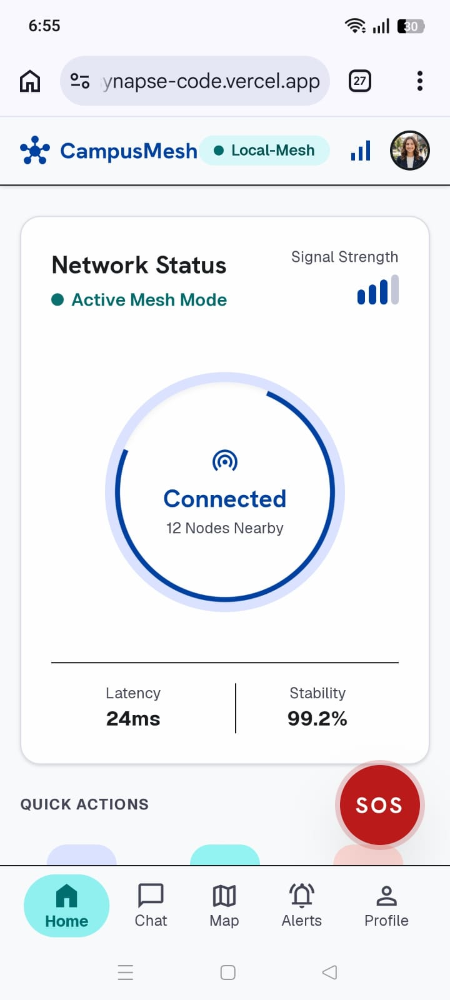
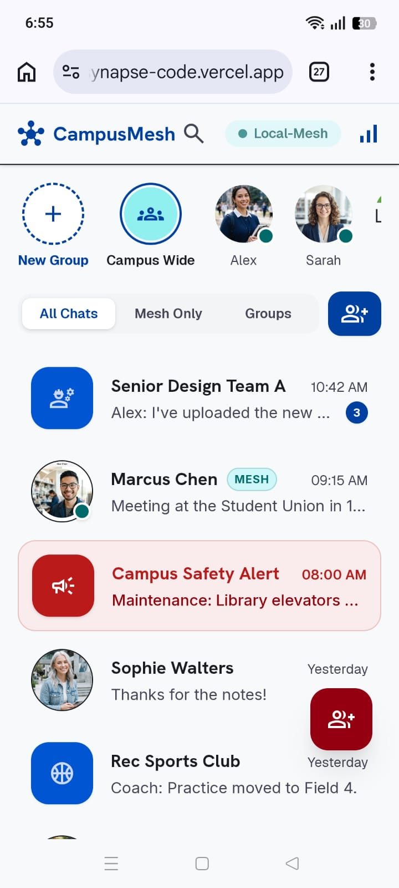
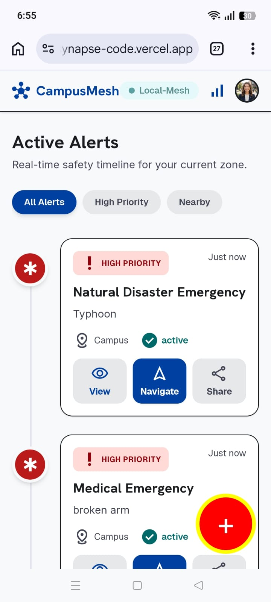

# 🎓 CampusMesh

CampusMesh is an AI-powered campus safety and emergency communication platform designed to help students, faculty, and university staff stay connected during emergencies. The application combines emergency alerts, AI assistance, offline-aware navigation, and campus communication into one easy-to-use platform.

---

## 🚀 Live Demo

**Live Application:**
[YOUR_VERCEL_URL](https://campus-mesh-roan.vercel.app)

**GitHub Repository:**
[YOUR_GITHUB_REPO_LINK](https://github.com/alishbash537-bot/CampusMesh)

---

# 📖 Problem Statement

During emergencies such as fires, medical incidents, network outages, or campus lockdowns, students often struggle to obtain accurate information quickly.

CampusMesh addresses this problem by providing:

* AI-powered emergency assistance
* Emergency broadcasts
* Campus communication
* Campus navigation support
* Quick access to safety information

The goal is to improve communication and emergency preparedness within a university campus.

---

# ✨ Features

* 🏠 Modern campus dashboard
* 🤖 AI Emergency Assistant powered by Google Gemini
* 💬 Campus messaging interface
* 🚨 Emergency broadcast system
* 🗺️ Campus map
* 👤 Student profile page
* 🔐 Login and registration pages
* 📱 Responsive mobile-friendly interface
* 🔥 Firebase integration
* ☁️ Live deployment on Vercel

---

# 🤖 AI Feature

CampusMesh includes an AI assistant built using Google's Gemini API.

The assistant helps users by answering emergency-related questions such as:

* Basic first aid
* CPR guidance
* Emergency procedures
* Campus safety information
* Emergency preparedness advice

The AI maintains conversation history and provides concise, easy-to-read responses optimized for mobile devices.

---

# 🧠 System Prompt

The Gemini AI is instructed using the following system prompt:

> You are CampusMesh AI, an intelligent emergency and campus support assistant running on a decentralized university mesh network. You provide concise, reliable first-aid guidance, campus navigation tips, emergency response protocols, and safety information. Keep responses calm, direct, and easy to read on mobile devices.

---

# 🛠 Technologies Used

## Frontend

* React
* TypeScript
* Vite
* Tailwind CSS

## Backend

* Express.js
* Node.js

## AI

* Google Gemini API
* @google/genai

## Database & Authentication

* Firebase
* Firebase Authentication
* Firestore Database

## Deployment

* Vercel
* GitHub

---

# 📸 Screenshots

## Home Screen



---

## AI Chat



---

## Emergency Broadcast



---

# 📦 Installation

## Clone the repository

```bash
git clone YOUR_GITHUB_REPO_LINK
```

## Install dependencies

```bash
npm install
```

## Create environment variables

Create a `.env.local` file in the project root.

Example:

```env
GEMINI_API_KEY=your_gemini_api_key

VITE_FIREBASE_API_KEY=your_firebase_api_key
VITE_FIREBASE_AUTH_DOMAIN=your_project.firebaseapp.com
VITE_FIREBASE_PROJECT_ID=your_project_id
VITE_FIREBASE_STORAGE_BUCKET=your_project.appspot.com
VITE_FIREBASE_MESSAGING_SENDER_ID=your_sender_id
VITE_FIREBASE_APP_ID=your_app_id
VITE_FIREBASE_MEASUREMENT_ID=your_measurement_id
```

**Do not commit your API keys or secrets to GitHub.**

---

# ▶️ Run Locally

Start the development server:

```bash
npm run dev
```

Open:

```
http://localhost:3000
```

---

# 📂 Project Structure

```
CampusMesh
│
├── assets
├── src
│   ├── components
│   ├── views
│   ├── firebase.ts
│   └── App.tsx
│
├── server.ts
├── package.json
└── README.md
```

---

# 🔒 Security

* Sensitive credentials are stored using environment variables.
* API keys are excluded from version control.
* Firebase is used for authentication and secure data storage.

---

# 🌟 Future Improvements

* Real-time campus notifications
* GPS-based emergency routing
* Voice interaction with AI assistant
* Push notifications
* Offline mesh synchronization
* Multi-language support

---

# 👩‍💻 Developer

**Alishba Shahzadi**

Developed as part of an AI application project demonstrating the integration of modern web technologies, cloud services, Firebase, and Google Gemini AI to improve campus safety and communication.

---

# 📄 License

This project was developed for educational purposes.
